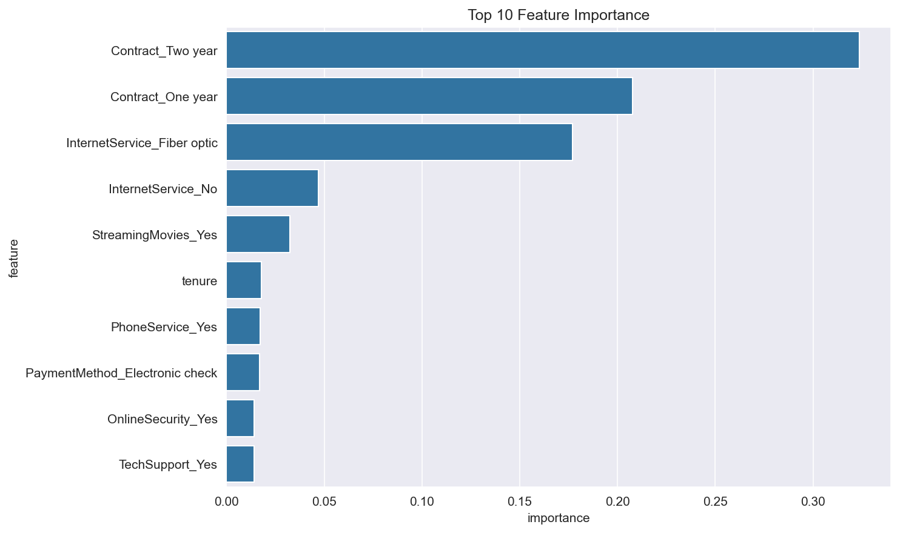
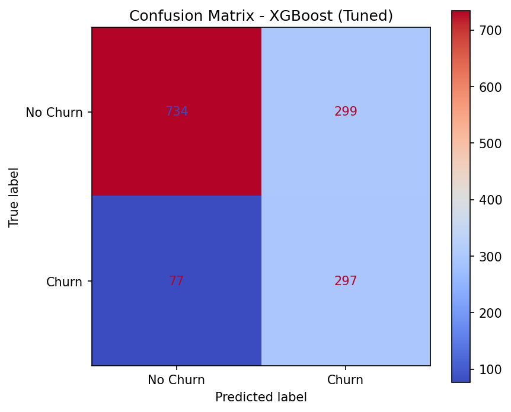

# Customer Churn Prediction

## Problem
Predicting whether a telecom customer will churn using machine learning.  
In churn prediction, **recall is the priority metric** — missing an actual churner 
is more costly than a false alarm.

## Dataset
- Source: [Telco Customer Churn](https://www.kaggle.com/datasets/blastchar/telco-customer-churn)
- 7,032 rows, 21 features
- Class imbalance: 73% No Churn, 27% Churn

## Project Structure
```
customer-churn/
├── Data/
│   └── Telco-Customer-Churn.csv
├── notebooks/
│   ├── 01_eda.ipynb
│   ├── 02_preprocessing.ipynb
│   └── 03_models.ipynb
├── src/
│   ├── preprocess.py
│   └── train.py
├── requirements.txt
└── README.md
```

## Models & Results

| Model | Accuracy | Churn Precision | Churn Recall | Churn F1 |
|---|---|---|---|---|
| Logistic Regression | 0.73 | 0.50 | 0.79 | 0.61 |
| Decision Tree | 0.69 | 0.45 | 0.84 | 0.59 |
| XGBoost | 0.74 | 0.50 | 0.76 | 0.60 |
| XGBoost (tuned) | 0.73 | 0.50 | **0.79** | 0.61 |

> The tuned XGBoost model was optimized via GridSearchCV (scoring=`f1`).  
> Best parameters: `learning_rate=0.1`, `max_depth=3`, `n_estimators=200`, `scale_pos_weight=2.76`

## Key Findings
- **Contract type** is the most predictive feature — month-to-month contracts churn at significantly higher rates
- **Fiber optic internet** users show higher churn despite being a premium service
- Class imbalance (73/27) was handled using `scale_pos_weight` in XGBoost and `class_weight='balanced'` in Logistic Regression
- Logistic Regression matches tuned XGBoost on recall (0.79) — a strong linear baseline for this dataset

## Visualizations

### Feature Importance (XGBoost Tuned)


### Confusion Matrix (XGBoost Tuned)


## How to Run
```bash
pip install -r requirements.txt
jupyter notebook
```